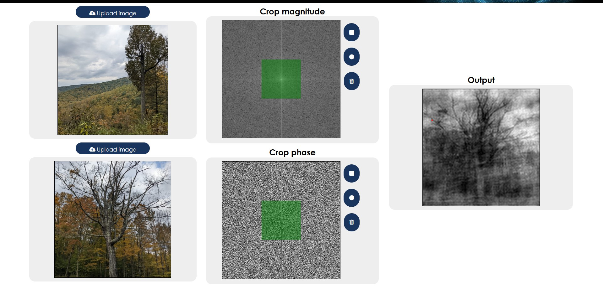
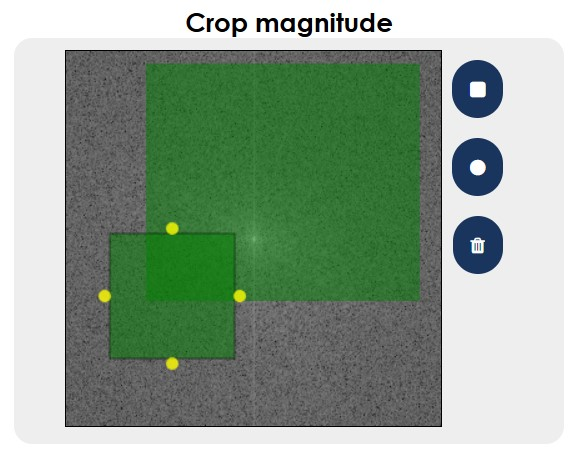
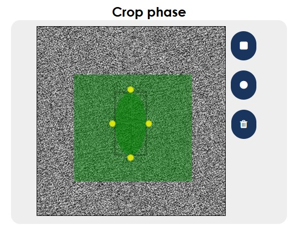
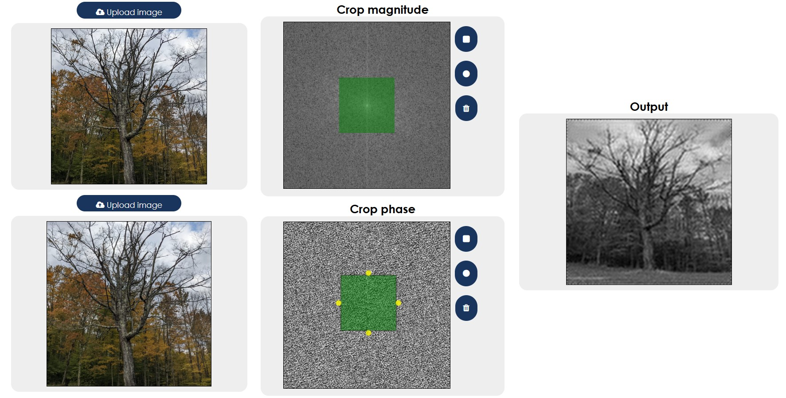
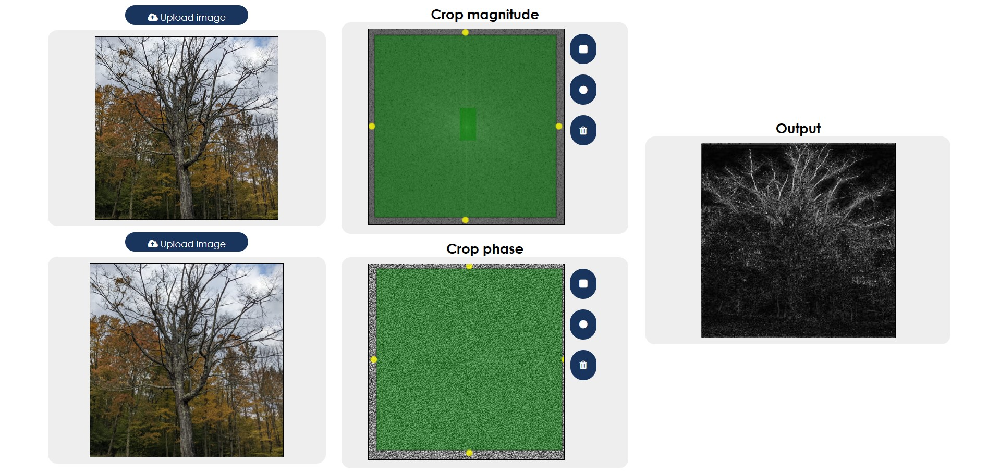

# Image compression /filtering visualization tool

## Description
This project is a tool meant to visualize compression and filtering of images by allowing the user to select different sections of the image in the frequency domain.

Note: all the output images are in greyscale

## Steps for installation
1. Install required packages \
   `pip install -r requirements.txt`
2. run the file titled "app.py"
3. go to your localhost and start using the project :)

## General features
### Crop magnitude
Allows you to select certain masks of the magnitude image, incase of using multiple shapes, the output is the intersection of them.

### Crop phase

Same but in the phase part of the image

## Scenarios

### Low pass filter
In other places this would be referred to as a blurring strategy, here we're filtering in the fourier domain and then reconstructing the image

### High pass filter
In other places this is used for edge detection.

